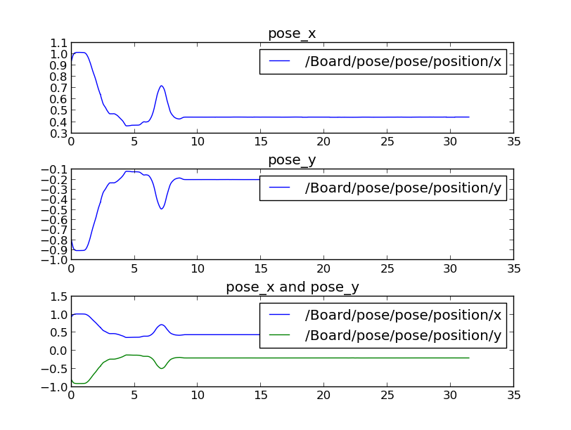

bag_plotter.py
--------------

bag_plotter is a script to plot from a bag file directly.


```
usage: bag_plotter.py [-h] [--duration DURATION] [--start-time START_TIME]
                      config bag

Plot from bag file

positional arguments:
  config                yaml file to configure plot
  bag                   bag file to plot

optional arguments:
  -h, --help            show this help message and exit
  --duration DURATION, -d DURATION
                        Duration to plot
  --start-time START_TIME, -s START_TIME
                        Start timestamp to plot
```

Format of yaml file is like:
```yaml
global:
  layout: <vertical, horizontal or manual, optional and defaults to vertical>
plots:
  - title:  <title of plot, required>
    topic:  <list of topics, required>
    field:  <list of accessor to get value to plot, required>
    layout: <2-d layout. if global/layout is manual, this field is required>
    legend: <show legend or not, optional and defaults to true>
```

the length of topic and field should be same.
You can use "array format" in field.

* `a/b/c[0]` means the 1st element of array `a/b/c`.
* `a/b/c[0:3]` means 1st, 2nd and 4rd elements of array `a/b/c`.

Example is like:
```yaml
global:
  layout: vertical
plots:
  - title: "rleg temp"
    topic: [/motor_states]
    field: ["driver_temp[0:6]"]
  - title: "lleg temp"
    topic: [/motor_states]
    field: ["driver_temp[6:12]"]
  - title: "leg force (z)"
    topic: [/off_lfsensor, /off_rfsensor]
    field: [wrench/force/z, wrench/force/z,]
```

When you want to use manual layout, example should be like follows:
```
global:
  layout: manual
plots:
  - title: "rleg temp"
    topic: [/motor_states]
    field: ["driver_temp[0:6]"]
    layout: [0, 0]
  - title: "lleg temp"
    topic: [/motor_states]
    field: ["driver_temp[6:12]"]
    layout: [0, 1]
  - title: "chest temp"
    topic: [/motor_states]
    field: ["driver_temp[12:15]"]
    layout: [1, 0]
  - title: "head temp"
    topic: [/motor_states]
    field: ["driver_temp[15:17]"]
    layout: [1, 1]
```

