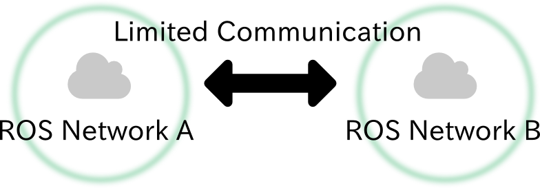
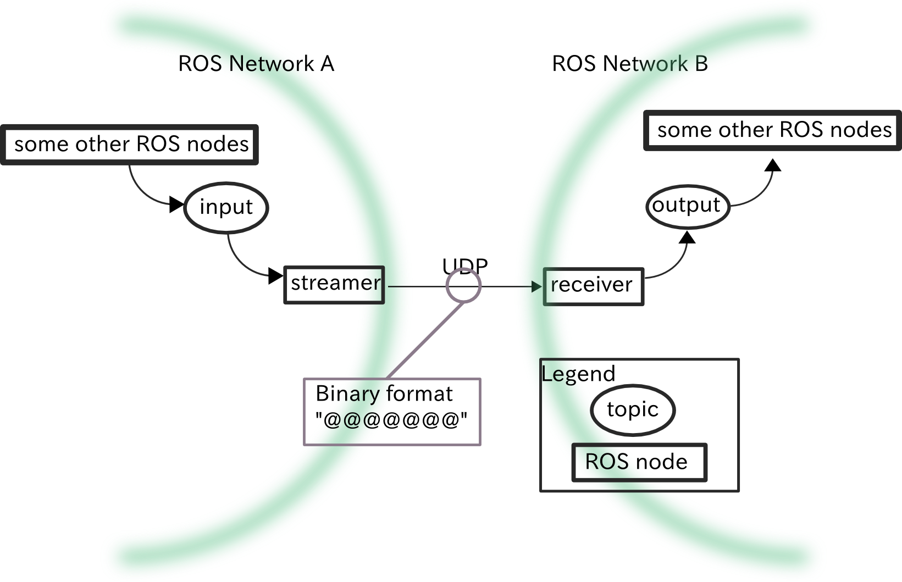
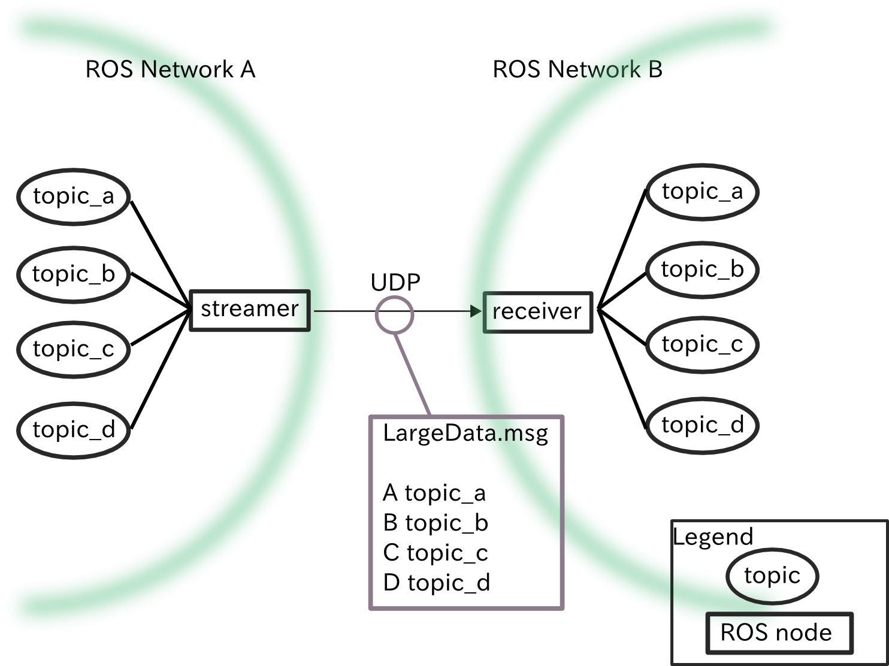

# jsk_network_tools
## Limited Network Communication.
The goal of silverhammer is to provide communication between two different ROS networks over limited network.


Currently jsk\_network\_tools supports two types of limited network model:

1. Unidirectional and narrow network.
2. Unidirectional and broad but intermittent network.

These two models are strongly inspired by [DRC-final](http://theroboticschallenge.org/).

### Problem of communication over limited network
The problems of 'limited network' are:

1. narrow bandwidth
2. intermittent connection

There problems cause following issues:

* Hand-shaking is high cost.

  Any kind of hand-shaking takes much time for example TCP hand-shaking and ROS node hand-shaking.
* Re-sending is high cost.

  Any kind of re-sending packets takes much time and consumes bandwidth for example TCP re-sending.
* Re-connection is high cost.

  Over intermittent connection, we need to re-connect over and over times. If bandwidth is narrow,
  hand-shaking is high cost mentioned above and re-connection is much high cost.


Because of these problems, we cannot use rich and well-designed communication tool such as ROS and ZMQ.

### Approach towards communication over limited network
jsk\_network\_tools' approach for the problems is quite simple.

* Use USP with fixed and periodic rate to remove hand-shaking of connection.
* For narrow band network, compress message as small as possible
* For broad band network, support rich and large message and separate them into smaller UDP packets.
* Our network model is streaming. jsk\_network\_tools provides `streamer` and `receiver`.
* jsk\_network\_tools is designed to cooperate with ROS communication suite.

### narrow network
jsk\_network\_tools provides `silverhammer_lowspeed_streamer.py` and `silverhammer_lowspeed_receiver.py`, which is
a gateway between two different ROS network over narrow network.



Features of `silverhammer_lowspeed_{streamer,receiver}.py` are:

1. Use UDP prevent hand-shaking and re-sending.

  Simply use UDP protocol with fixed rate.
2. Serialize data into small binary format.

  Automatically generate serialization format from definition of ROS message.
  However, this serialization only supports the simplest message definition.
  Limitation of the serialization are:

  1. No nested field is allowed. Only [built-in types](http://wiki.ros.org/msg#Message_Description_Specification) are supported.
  2. No variable length array and `string` are allowed.
  3. `int8`, `duration` and `time` are not supported.

  `silverhammer_lowspeed_gateway.py` uses python [struct](https://docs.python.org/3/library/struct.html) module to serialize/deserialize messages.

3. Input is one topic and output is also one topic.

  In order to tucke against narrow bandwidth, we need to chose and compress transferred data.
  Therefore, input and output of streamer and receiver are limited to only one topic.

### broad network
jsk\_network\_tools provides `silverhammer_highspeed_streamer.py` and
`silverhammer_highspeed_receiver.py` to achieve high-throughput over broadband network.


Features of `silverhammer_lowspeed_{streamer,receiver}.py` are:
1. Use UDP prevent hand-shaking and re-sending.

  Simply use UDP protocol with fixed rate.
2. Serialize/Deserialize data using ROS serialization.

  On this model, jsk\_network\_tools utilizes ROS serialization.
  Only one limitation is that the types of the fields should be another
  ROS type such as `sensor_msgs/Image`, `geometry_msgs/Pose` and so on.
3. Split ROS message into small UDP packets and collect them into ROS message.

4. Input and output are multiple-topics.

  The topics which streamer subscribes and receiver publishes are automatically
  decided according to definition of [FC2OCSLargeData.msg](msg/FC2OCSLargeData.msg).

  The rule is simple:
  > Each field name represents topic name and `__` (double under scores) is
  >  replaced by `/`.

  For example, you want to tranfer `/camera/rgb/image_rect` topic, your message should have
  following field definition.

  ```
  sensor_msgs/Image camera__rgb__image_rect
  ```

  Streamer automatically split one big data into small UDP packets. Receiver
  collects the packets and re-publish the messages to the topics.

  Format of the UDP packet is:
```
    +--------+-----------+------------+-----------------+
    | Seq Id | Packet Id | Packet Num | Data ...        |
    +--------+-----------+------------+-----------------+
    |   4B   |     4B    |      4B    |                 |
    |<-------------------Staic Size--------------------->
```

  * Seq Id

    Sequence Id. This is incremented when streamer sends new ROS message.
  * Packet Id

    It is incremented when streamer sends new packet.
  * Packet Num

    The number of the packets for receiver to decode packets.

### Software manual
#### `silverhammer_lowspeed_streamer.py`
##### Subscribing Topics
* `~input`

  Type of `~input` topic is specified by `~message` parameter.

##### Parameters
* `~message` (default: `jsk_network_tools/FC2OCS`)

  ROS message type to send over UDP. It should follow limitation of message
  definition described above.
* `~to_port` (default: `1024`)
* `~to_ip` (default: `127.0.0.1`)

  Port number and hostname to send message.
* `~send_rate` (default: `1`)

  Fixed rate in Hz to send message.
* `~event_driven` (default: `False`)

  Streamer sends UDP packet immediately `~input` topic is published.
#### `silverhammer_lowspeed_receiver.py`
##### Publishing Topics
* `~output`

  Type of `~output` topic is specified by `~message` parameter.

##### Parameters
* `~message` (default: `jsk_network_tools/FC2OCS`)

  ROS message type to receive over UDP. It should follow limitation of message
  definition described above.
* `~receive_port` (default: `1024`)
* `~receive_ip` (default: `127.0.0.1`)

  Port number and hostname to receive message.
* `~receive_buffer_size`

  Buffer size to receive UDP packet.


#### `silverhammer_highspeed_streamer.py`
##### Subscribing Topics
Input topics are automatically determined by message definition specified
by `~message` parameter.

##### Parameters
* `~message` (default: `jsk_network_tools/FC2OCSLargeData`)

  ROS message type to send over UDP. It should follow limitation of message
  definition described above.
* `~to_port` (default: `16484`)
* `~to_ip` (default: `localhost`)

  Port number and hostname to send message.
* `~send_rate` (default: `2`)

  Fixed rate in Hz to send message.
* `~packet_size` (default: `12000`)

  Packet size of UDP. ROS message will be splitted into the packets
  of `~packet_size`. Unit is byte.

* `~packet_interval` (default: `0.001`)

  Interval between sending each packet to avoid consume large amount of bandwidth.

#### `silverhammer_highspeed_receiver.py`
##### Publishing Topics
output topics are automatically determined by message definition specified
by `~message` parameter and `~topic_prefix` parameter.
##### Parameters
* `~message` (default: `jsk_network_tools/FC2OCSLargeData`)

  ROS message type to receive over UDP. It should follow limitation of message
  definition described above.
* `~receive_port` (default: `16484`)
* `~receive_ip` (default: `localhost`)

  Port number and hostname to receive message.
* `~packet_size` (default: `1000`)

  Packet size of UDP.

* `~topic_prefix` (default: `/from_fc`)

   Prefix added in front of output topics.

* `~pesimistic` (dfeault: `False`)

  Do not concatenate packets with 0 filling if this parameter is True.
